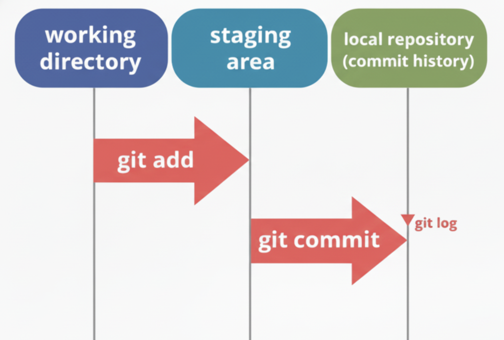
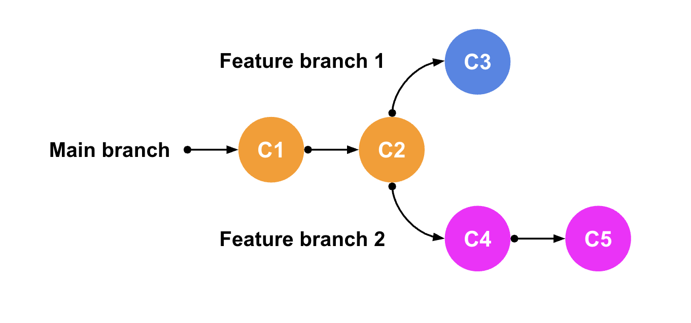
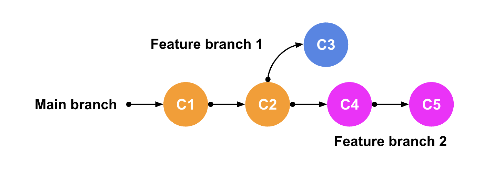
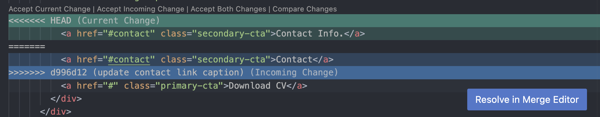

# 📚 Git Commands: A Chaptered Guide

This guide provides a structured, chapter-by-chapter series of lessons on the essential Git commands for version control, covering everything from initial setup to branching and merging.

---

## 1. Set up Repository

This is the starting point for any project. You first need to confirm Git is installed and then initialize a local repository.

| Command | Description |
| :--- | :--- |
| `git version` | Check the currently installed version of Git. |
| `git init` | **Initialize** a new local Git repository in the current directory. |

> **Prerequisite:** Ensure the project has the files `index.html`, `about.html`, `contact-form.html`, and `assets/styles.css` before proceeding.

---

## 2. Staging Files

Git uses a three-state architecture:
1.  **Working Directory:** Where you make your changes.
2.  **Staging Area (Index):** A temporary area where you prepare a snapshot of changes before committing. You move files here using `git add`.
3.  **Repository (Commit History):** All the historical snapshots (commits) of your project are stored here.

Here's a visual representation of the threee-state architecture:




| Command | Description |
| :--- | :--- | 
| `git status` | Check the current state of the working directory and staging area. Shows which files are tracked, modified, and staged. |
| `git add index.html` | Stage a **single file** for the next commit. |
| `git add about.html contact-form.html` | Stage **multiple specified files** simultaneously. |
| `git add .` | Stage **all changes** in the current working directory. |

> **Note:** **Use `git add .` with caution** as this command moves ALL files to the staging area.

---

## 3. Making Commit 

A commit takes the staged changes and permanently records them as a **historical snapshot** in the repository.

| Command | Description |
| :--- | :--- |
| `git commit -m "add initial web application structure and pages"` | Create a new commit with a descriptive message (`-m`). |
| `git log` | **View the commit history**, showing details like commit hash, author, date, and commit message. |

> **Next Steps:** Make some changes to the project files (e.g., install Live Server to view changes made).
>
> 1.  `git status` (Check the modified files.)
> 2.  `git add .` (Add all modified files to the staging area.)
> 3.  `git commit -m "correct title to the pages"` (Commit the new snapshot)
> 4.  `git log` (View the updated history)

> **Note:** On a particular branch, different files can be staged and committed for different reasons (i.e., you can commit a specific feature fix separate from a large-scale refactor).

---

## 4. Delete & Untracking files

You can manage the removal or exclusion of files from Git's tracking system.

| Scenario | Command | Description |
| :--- | :--- | :--- |
| **Unstage a Staged File** | `git restore --staged <staged file>` | Move a file **from the staging area back to the working directory** (undoing the `git add`). |
| **Discard Local Changes** | `git restore <modified filename>` | **IMPORTANT:** Unstage the file first using `git restore --staged <modified filename>`. Then, use this command to discard unstaged local modifications in the working directory and revert the file to its last committed state. |
| **Stop Tracking a File (but Keep It)** | `git rm --cached <file not be tracked>` | **Crucial:** Completely tell Git to stop tracking a file and remove it from the repository's index, but **keep the actual file** in the working directory. |

---

## 5. Viewing Project History

Git offers several commands to inspect and compare the repository's history.

| Command | Description |
| :--- | :--- |
| `git log --oneline` | Print a concise, **single-line** summary for each commit (hash and message). |
| `git log --stat` | Show the commits and the statistics (lines added/removed) for each file changed in the commit. |
| `git show <commit-hash>` | Perform a **deep dive** into a specific commit, showing the complete file differences (the "diff"). |
| `git diff <hash-1> <hash-2>` | Show the specific **differences between two commits**. |

---

## 6. Undoing Changes

These commands allow you to rewrite, move, or clean up your project's history. These commands should be used with caution, especially on shared repositories.

> **Note:** Before undoing changes, use the command`git reflog` as a **safety net** to list and check all changes to your local history, including commits that were reset. However, the information can be pruned by Git and may not be around forever.

| Command | Description |
| :--- | :--- |
| `git revert <target-commit-to-revert>` | **IMPORTANT:** Undo a previous commit by creating a **NEW commit** that reverses the changes. This is the **safest** way to undo shared history. |
| `git reset --hard <commit-hash-to-reset-to>` | **DANGEROUS:** **Move the project** (and the HEAD pointer) to the specified previous commit, **discarding all subsequent changes** from both the staging area and the working directory. |
| `git reset <commit-hash>` | Move the project to a previous commit, but **keep the subsequent changes** in the working directory (unstaged). |

---

## 7. `.gitignore` file

The `.gitignore` file tells Git which files and folders to completely ignore and exclude from tracking, keeping your repository clean and secure.

> **Example `.gitignore` content:**

```
notes.txt

# ignore the folder and its contents
node_modules/ 
 
# ignore the file that stores sensitive data
.env

# ignore all files that have the extension .log
*.log 
```

> You should **stage and commit** the `.gitignore` file itself so the rules are shared with the team.

> **Resource:** Find pre-made templates for common projects here: [https://github.com/github/gitignore](https://github.com/github/gitignore)

---

## 8. Creating branches

Branching is Git's core feature, allowing developers to safely create a separate line of development without affecting the main codebase.


> **Concept:**
Here's a visual representation of how branching works:




| Command | Description |
| :--- | :--- |
| `git branch` | List all local branches and show the current working branch. |
| `git branch feature-1-branch` | **Create a new branch** locally without switching to it. |
| `git switch feature-1-branch` | **Switch to** the newly-created branch (introduced in Git ^v2.2). |
| `git switch -c feature-2-branch` | **Create a new branch AND switch to it** in one command. |
| `git log --oneline` | Use this command on the main branch, then on the feature branch, to **witness the divergence** in commit history. |

> **Advantages of Branching:**
> * **Freedom to Experiment:** Work without affecting working code.
> * **Team Collaboration:** Multiple members can work on different features simultaneously.
> * **Cleaner History:** Commit history remains cleaner and focused.
> * **Ease-of-Management:** Enables review and testing before merging into the main branch.

---

## 9. Merging branches

Merging integrates the changes from a separate branch back into your main line of development, combining their histories.

**Fast-Forward Merge** is most common. If the main branch hasn't changed since the feature branch was created, Git simply moves the `main` branch pointer forward to the latest commit on the feature branch.

> **Goal:** Merge `feature branch` back into `main branch`.

Here's a visual representation of how **merging** works:



| Command | Description |
| :--- | :--- |
| `git switch main` | Ensure you are on the **receiving branch** (the one you want to update). |
| `git merge feature-branch` | **Integrate** all the commits from `feature-branch` into the current `main` branch. |

---

## 10. Cleaning up branches

| Command | Description |
| :--- | :--- |
| `git switch main` | Ensure the branch to delete is **NOT in use**. |
| `git branch -d feature-branch` | **Delete** the merged branch. |
| `git branch -D another-feature-branch` | **Force delete** the branch, ignoring warnings about unmerged commits (use with extreme caution). |

---

## 11. Cloning a Project

```
git clone https://github.com/<username>/<remote-repository-name>.git .
```

**Note:** When a single period (.) is placed at the end of the git clone command, it tells Git to clone the repository into the current directory (or working directory) rather than creating a new subdirectory.


There are two primary methods Git uses to communicate with a remote repository (like those hosted on GitHub, GitLab, or Bitbucket) and the difference is how they handle authentication and connection.

* **HTTPS** is often the easiest and most universal way to get started, authenticating with your username and password or a dedicated, temporary, and revocable Personal Access Token (PAT).

* **SSH** is a protocol designed for secure remote command execution, it uses cryptographic keys (a public key and a private key) for authentication.

---

## 12. Forking a Repository

Forking is a process that occurs on the **hosting service** (e.g., GitHub, GitLab, Bitbucket) and is commonly used when you want to contribute to an open-source project or create your own version of a project you don't have push access to.

A **fork** is essentially a **server-side copy** of a repository under your own account. Once forked, you have full administrative rights over your copy, allowing you to clone it locally, push changes to it, and propose those changes back to the original ("upstream") repository via a **Pull Request**.

> ### The Difference: Forking vs. Cloning

| Feature | Forking | Cloning |
| :--- | :--- | :--- |
| **Location** | **Remote:** Creates a full copy of the repository on the *hosting platform* (e.g., GitHub) under your account. | **Local:** Creates a copy of the repository on your *local machine* (your hard drive). |
| **Purpose** | To own a copy of the repository to make changes and propose them back to the original project or start a new project. | To download the code to a local machine to work on it. |
| **Access** | Grants you **full push access** to your personal copy (the fork) on the remote server. | Creates a local copy that typically only allows you to push to the *original* repository if you have **permission**. |
| **Command** | Done via a **button/link** on the hosting platform's website (No Git command). | Done using the Git command **`git clone`**. |

---

## 13. Resolving a conflict (Divergent Branch) 💥

A **merge conflict** happens when two different branches (or a local branch and its remote counterpart) have made changes to the **same lines** in the **same file**. The process of resolving this generally involves fetching the latest remote changes and then merging them into your local branch. Using **`git pull --rebase`** is often a cleaner way to integrate changes by applying your local commits *on top* of the remote commits.

| Step | Command / Action | Description |
| :--- | :--- | :--- |
| **1. Access Target Branch** | `git switch <branch-name>` | Ensure you are on the local branch where you want to integrate the remote changes (e.g., `main` or `feature-x`). |
| **2. Review All Branches** | `git branch -a` | (Optional) View local and remote-tracking branches to confirm the remote branch's status. |
| **3. Pull with Rebase** | `git pull --rebase` | Retrieve the latest changes from the remote and attempt to apply your local commits *on top* of the remote changes. This command is often used to avoid creating unnecessary merge commits and can trigger the conflict resolution process. |
| **4. Resolve Conflicts** | *Use your IDE (e.g., VS Code)* | If a conflict occurs, Git will pause the rebase. Go through each conflicting file and manually choose which changes to keep. Either use the **Resolve in Merge Editor** to **`Accept Current Change`**, **`Accept Incoming Change`**, **`Accept Both Changes`** or manually resolve the changes, followed by deleting all conflict markers (`<<<<<<<`, `=======`, `>>>>>>>`).  |
| **5. Stage Resolved Files** | `git add <resolved-file>` | After resolving the content in all conflicted files, stage them so that Git understands that the conflict is resolved. |
| **6. Complete the Rebase** | `git rebase --continue` | After staging all resolved files, use this command to **resume the paused rebase operation**. Git will apply the next commit. Repeat steps 4-6 if more commits have conflicts. |
| **7. Push Changes** | `git push` | Once the rebase is complete, push the newly rebased (and cleaner) history to the remote repository. |

---

© 2025. Prepared by Martin Leong.